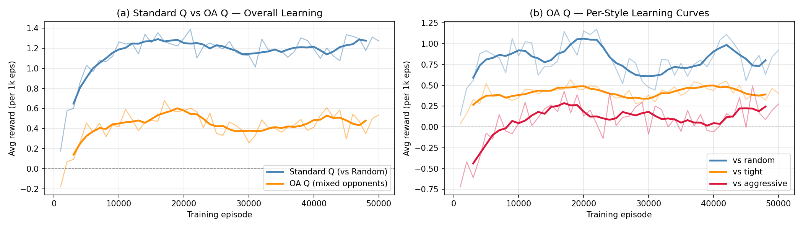
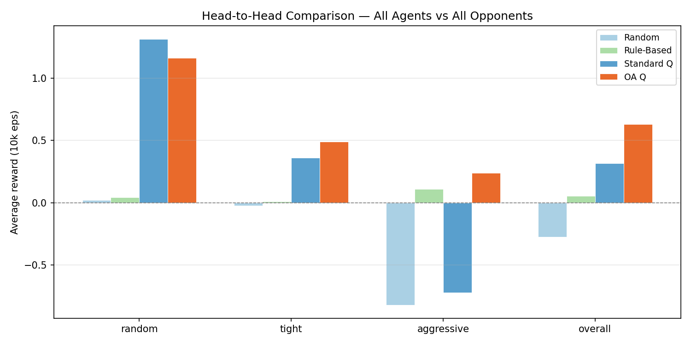
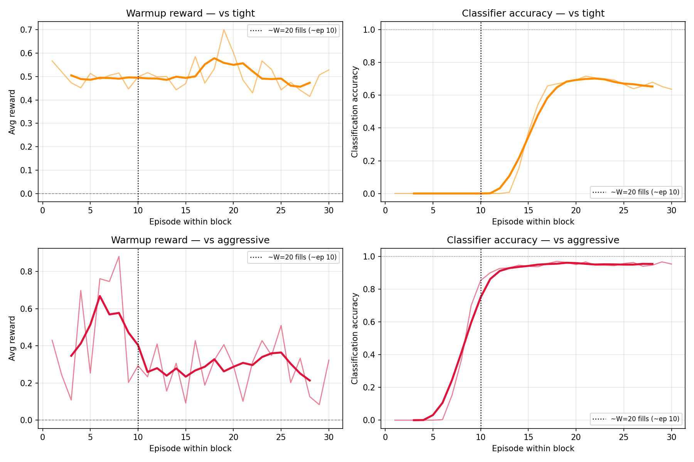

# 🃏 Opponent-Aware Q-Learning for Leduc Hold'em

Welcome to the **Group 14** Reinforcement Learning Project! This repository implements and evaluates an **Opponent-Aware Q-Learning Agent** for **Leduc Hold'em** (a simplified version of Texas Hold'em poker) using the `RLCard` framework.
---

## 📑 Project Reports

For a deep dive into the methodology, mathematical formulations, and detailed evaluation, please refer to our official project reports:
- 📄 [**Project Report 1**](./Group14_RL_projectReport.pdf)
- 📄 [**Project Report 2 (Final)**](./Group14_RL_projectReport_2.pdf)

*(Click the links above to view the PDF reports directly in the repository)*

---

## 🌟 1. High-Level Overview

The primary goal of this project is to design a Reinforcement Learning (RL) agent that avoids playing a single, static strategy. Instead, the agent actively **infers the playstyle of its current opponent** (e.g., tight, aggressive, or random) and dynamically adapts its strategy to exploit their specific weaknesses.

By giving a tabular RL agent a basic "Theory of Mind," this project elegantly solves a fundamental flaw of standard RL in multi-agent, imperfect-information environments.

---

## 🧠 2. The Problem with Standard Solutions

In standard tabular **Q-Learning** (implemented as a baseline in `q_agent.py`), the agent learns a policy that maps a given "State" (its cards + the betting history) to an "Action" (fold, call, raise). 

**The Flaw in Imperfect Information Games:**
Poker is an imperfect information game. A specific state (e.g., "I have a King and the opponent just raised") can mean entirely different things depending on *who* the opponent is:
* If the opponent is **Tight** (only plays premium hands), their raise indicates strength, and the optimal move is usually to fold.
* If the opponent is **Aggressive** (frequently bluffs), their raise might be weak, and the optimal move is to call or re-raise.

Standard Q-Learning ignores the opponent's identity. If trained against a Random opponent, it learns a single "average" strategy. When faced with an aggressive or tight player later, it cannot adapt, causing performance degradation because it applies the exact same logic to every opponent.

---

## 💡 3. Our Approach: Opponent-Aware (OA) Q-Learning

To overcome this limitation, this project augments standard Q-learning with **Opponent Modeling**. 

Rather than treating the environment as a static entity, the agent actively observes the opponent's behavior, categorizes their playstyle, and uses that categorization to alter its perception of the game state. 

Effectively, the agent learns **three separate Q-tables**—one tailored for each specific type of opponent—and switches between them on the fly.

---

## ⚙️ 4. Technical Architecture

The solution is divided into two main components:

### Step 1: The Classifier (`classifier.py`)
The classifier acts as the agent's "eyes," figuring out the opponent's style during gameplay.
* **Sliding Window:** It maintains a rolling memory of the opponent's last 20 actions.
* **Frequency Tracking:** Calculates action frequencies over that window (`f_raise`, `f_fold`, `f_bet`).
* **Classification Rules:** Empirically tuned for Leduc Hold'em:
  * **Aggressive:** `f_raise > 0.45`
  * **Tight:** `f_fold > 0.40` and `f_raise < 0.05`
  * **Random:** Default/Warmup phase.

### Step 2: The Opponent-Aware Q-Agent (`oa_agent.py`)
This is the core decision-maker. It modifies standard Q-learning by augmenting the "State Key".
* **Standard State Key:** `(observation)`
* **Opponent-Aware State Key:** `(observation, style_label)`

**The Execution Flow:**
1. **Act:** Queries the classifier for the opponent's style. Looks up Q-values for `(observation, style)` and acts.
2. **Observe:** Feeds opponent actions into the Classifier to update the sliding window.
3. **Update (Bellman Backup):** Updates Q-value for the acted state/style, but target reward uses the *next state and newly updated style label*.

### Step 3: Block Training Strategy
To ensure the agent learns to defeat all playstyles, we use a **Block Strategy**:
* The agent trains against Random, Tight, and Aggressive opponents in rotating blocks of 30 episodes.
* This forces the agent to constantly shift gears, allowing the classifier to lock onto a clean signal and populate the correct "compartment" of the Q-table.

---

## 📊 5. Results & Visualizations

Our experiments (`step6_experiments.py`) validate the OA approach across 50,000 training episodes and 10,000 evaluation episodes per opponent style.

### 📈 Learning Curves
Both the standard Q-agent and OA Q-agent converge, but the OA agent dynamically adapts its learned values based on the block opponent.

### ⚔️ Head-to-Head Performance
Once correctly classified, the OA agent successfully exploits specific opponents: it learns to bluff tight players and trap aggressive players. This leads to **significantly higher average rewards** against predictable opponents compared to a standard Q-Learning agent.

### 🔥 Classifier Warmup Analysis
When facing a new opponent, the classifier takes roughly **~10-20 episodes** (the W=20 window size) to confidently label them. As the classification accuracy spikes, the agent's reward sharply increases.

---

## 🚀 6. Repository Structure & Usage

### Core Files
* `agents.py`: Contains the 4 evaluation opponents (Random, RuleBased, Tight, Aggressive).
* `classifier.py`: The `OpponentStyleClassifier` logic.
* `q_agent.py`: Standard baseline Q-Learning Agent.
* `oa_agent.py`: The proposed **Opponent-Aware** Q-Learning Agent.

### Running the Pipeline
The `step*_*.py` scripts are designed to be run sequentially to understand and reproduce the full project lifecycle:

1. **Test Environment:** `python step1_test_env.py`
2. **Evaluate Baselines:** `python step2_baselines.py`
3. **Train Standard Q-Learning:** `python step3_qlearning.py`
4. **Test Classifier:** `python step4_classifier.py`
5. **Train Opponent-Aware Agent:** `python step5_opponent_aware.py`
6. **Master Evaluation & Plotting:** `python step6_experiments.py` (Runs everything, generates JSONs and `plot*.png` figures)

---
*Developed for the Reinforcement Learning Final Project - Group 14.*
